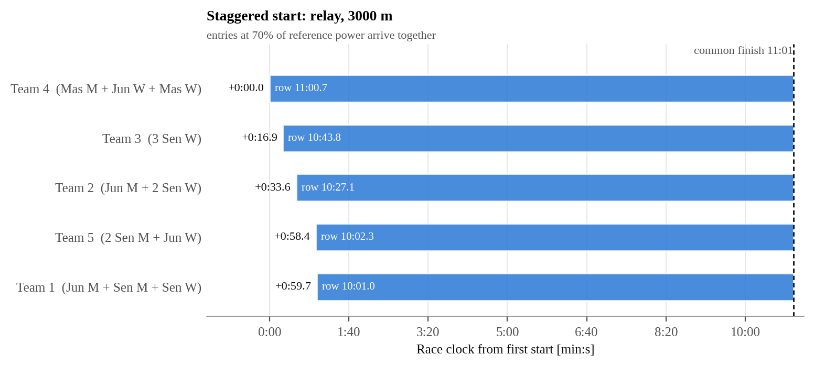
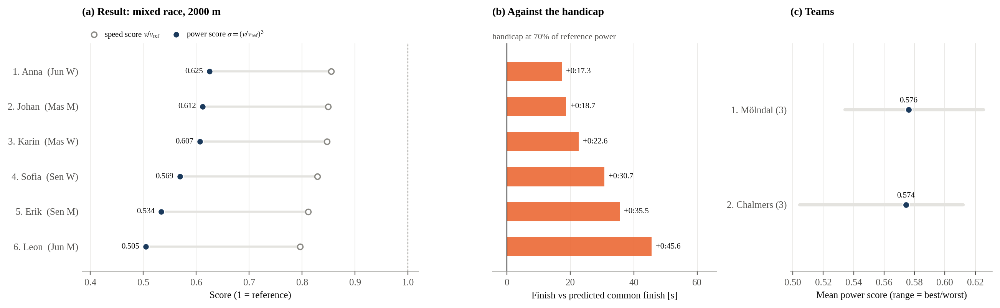

# ERGrace Normalizer

A Python package for fair rowing races across genders, age categories and boat classes: **relay races** (a team takes turns on one erg), **mixed races** (individuals of different categories) and **crew races** (mixed crews in different boats), over a fixed time or distance. It computes handicaps before the race (staggered starts or target distances) and a composition-fair power score after it.

## What It Does

Men and women, juniors, seniors and masters, and single sculls and eights differ systematically in speed, so the raw result is not a fair comparison. **ERGrace** asks *what fraction of their reference power did the athletes of each entry sustain?* It uses this to

1. set **handicaps before the race**: a staggered start so everyone arrives together, or target distances for timed races;
2. **score after the race**: the power score `σ = (v / v_ref)³`, where 1 means rowing exactly at reference.

The speed score `v / v_ref` and σ give the same ranking; σ reports it on the scale of what the athletes actually produce (a 7 % speed deficit is a 20 % power deficit).

## Installation

```bash
git clone https://github.com/lukassplitthoff/ergrace-normalizer.git
cd ergrace-normalizer
pip install -e .
```

Requirements: Python 3.7+, numpy, pandas, matplotlib. Optional: `pip install -e ".[notebooks]"` for the example notebooks, pytest for the tests.

## Which Class for Which Race?

| Your race | Class | One entry is |
|---|---|---|
| a team takes turns on **one** ergometer (any team size or mix) | `RelayRace` | a team |
| individuals of different categories, one ergometer each | `MixedRace` | an athlete (optionally with a team label) |
| boats of different classes (1x … 8+) with mixed crews, on the water | `CrewRace` | a crew in one boat |

Every class takes exactly one of `time=` (the result is a distance) or `distance=` (the result is a time). Athletes are given by category, e.g. `"Senior M"`, `"Junior W"`, `"Master F"` (`"M"` alone means senior men).

- **Before the race**, `handicaps()` gives a **staggered start** for distance races, so that all entries rowing at the same fraction of their reference power arrive together. For timed races it gives a **target distance** (metre credit) per entry.
- **After the race**, `record({...})` and `results()` rank entries by the power score σ, the fraction of reference power sustained.
- `plot_handicaps()` and `plot_results()` draw both.

### Getting started: three notebooks

| Notebook | Shows |
|---|---|
| [01_relay_race.ipynb](examples/notebooks/01_relay_race.ipynb) | timed and distance relays; limit cases: score 1 at reference, time vs distance split, team sizes and fatigue, `level`, consistency with the RRC 2026 report |
| [02_mixed_race.ipynb](examples/notebooks/02_mixed_race.ipynb) | 2000 m staggered start with team ranking, 20-min race with club references; limit cases: one category, σ = 1, only ratios matter, fatigue, label parsing |
| [03_crew_race.ipynb](examples/notebooks/03_crew_race.ipynb) | 6 km head race with 1x–8+ mixed crews, timed crew race; limit cases: homogeneous crews, why crews and relays combine differently, fatigue, validation |

### Relay

```python
from ergrace import RelayRace

relay = RelayRace(time="30:00", teams={            # or distance=3000
    "Team 1": ["Junior M", "Senior W", "Senior M"],
    "Team 2": ["Junior M", "Senior W", "Senior W"],
    "Team 3": {"Senior W": 3},                     # counts work too
}, level=0.7)

relay.print_handicaps()        # fixed time: target distance and credit per team
relay.plot_handicaps("handicaps.png")

relay.record({"Team 1": 8480, "Team 2": 8120, "Team 3": 7710})   # metres
relay.print_results()
relay.plot_results("results.png")
```

`split` sets how a team shares the work: `"time"` (swap on the clock; default for timed races) or `"distance"` (equal legs, e.g. 3 × 1000 m; default for distance races). For a fixed-distance relay, `record` takes times: `{"Team 1": "10:02.4", ...}`.

### Mixed race

```python
from ergrace import MixedRace

race = MixedRace(distance=2000, level=0.7, lanes={   # or time="20:00"
    1: ("Anna", "Junior W", "Mölndal"),              # (name, category, team)
    2: ("Erik", "Senior M", "Mölndal"),
    3: "Master W",                                   # just a category
})
race.print_handicaps()         # fixed distance: who starts when
race.plot_handicaps("start.png")

race.record({"Anna": "7:48.0", 2: "6:52.5", 3: "8:06.2"})        # by name or lane
race.print_results()
race.print_team_results()      # mean power score per team, if teams are given
race.plot_results("results.png")
```

### Handicaps

- **Fixed distance:** the slowest entry starts first; everyone else starts later by the difference in expected time, so all entries rowing at the same fraction of their reference power **arrive together**. The first across the line wins.
- **Fixed time:** each entry gets a target distance; the credit is the metres to add to its result.
- `level` is the expected fraction of reference power (default 1.0). It scales the start offsets and targets (club crews typically row at 0.6–0.8 of world-record power) but not their order.

Staggered start for a 3000 m relay, and a mixed-race result:




### Crew race (boats on the water)

```python
from ergrace import CrewRace

head = CrewRace(distance=6000, level=0.7, crews={          # or time="20:00"
    "Mixed 4x":  ("4x", ["Senior M", "Senior W", "Junior M", "Junior W"]),
    "Women 2x":  ("2x", ["Senior W", "Senior W"]),
    "Master 1x": ("1x", "Master M"),
    "Mixed 8+":  ("8+", {"Senior M": 4, "Senior W": 4}),
})
head.print_handicaps(); head.plot_handicaps("start.png")
head.record({"Mixed 4x": "20:52", "Women 2x": "22:10",
             "Master 1x": "24:40", "Mixed 8+": "18:20"}).print_results()
```

The boat references (`BoatReferences.default()`: a 2000 m time per boat class and category, hull advantage included) are **editable placeholders**. Pass your own with `references=BoatReferences(2000, {"1x": {"Senior M": "7:05", ...}, ...})`.

### Fatigue (optional)

References are 2000 m times, applied at any distance assuming constant power. `fatigue=5` applies Paul's law: each athlete's reference split slows by 5 s/500 m per doubling of the distance they actually row. In a distance race everybody rows the same distance, so the start offsets don't change. It matters when athletes row different distances, e.g. **relay teams of different sizes**: a solo rower in a 30-min relay rows five times as far as each member of a five-person team.

### References

`References.default()` holds 2000 m reference times per category. **Senior** values are the open world records (5:34.7 / 6:21.1). **Junior and master values are placeholders** (+5 % and +8 % in time, the same factors as the on-water table) and should be replaced with the references you want. Only the ratios between categories matter.

```python
from ergrace import References
refs = References(2000, {"Senior M": "6:30", "Senior W": "7:25",
                         "Junior M": "6:45", "Junior W": "7:45"})
refs = References.default().updated({"Junior W": "6:55.0"})     # override some
race = MixedRace(time="20:00", references=refs, lanes={...})
```

Scripts: [relay_race.py](examples/races/relay_race.py), [mixed_race.py](examples/races/mixed_race.py), [crew_race.py](examples/races/crew_race.py).

### How entries are compared

Each category has a reference speed `v = d_ref / t_ref` (power `P = 2.8 v³`). Assuming every athlete of an entry rows at the same fraction σ of their reference power, the entry's reference speed is a mean of its athletes' speeds, set by what adds up:

- `MixedRace`: the athlete's own reference speed;
- `RelayRace`, equal **time** shares: distances add, so the arithmetic mean of speeds;
- `RelayRace`, equal **distance** legs: times add, so the harmonic mean;
- `CrewRace`: all seats pull at once and powers add, so `(mean v³)^(1/3)`, i.e. the mean of seat powers.

With the observed mean speed `v = D / T`, the score is `σ = (v / v_ref)³`. The constant 2.8 cancels. References at 2000 m are applied at other distances assuming constant power: absolute predicted times are optimistic for long races, but ratios, handicaps and rankings are unaffected. `ERGNormalizer` below is the original men/women interface for a fixed-time relay with equal time shares.

## ERGNormalizer (original men/women relay interface)

The first interface of the package, used in the RRC 2026 report: a timed relay with men and women, rowers swapping on the clock. It gives the same scores as `RelayRace(time=..., teams={...: {"Senior M": n_m, "Senior W": n_w}})`.

```python
from ergrace import ERGNormalizer

teams = {
    'Team A': {'n_men': 3, 'n_women': 2, 'distance_m': 6319},
    'Team B': {'n_men': 2, 'n_women': 3, 'distance_m': 5530},
    'Team C': {'n_men': 0, 'n_women': 5, 'distance_m': 5819},
}

normalizer = ERGNormalizer(duration_s=20 * 60)      # 20-minute relay
normalizer.add_teams_from_dict(teams)
normalizer.calculate_scores()
normalizer.print_results()
normalizer.plot_results('results.png')
```

## Physics (ERGNormalizer and RelayRace)

### Power from pace

The Concept2 monitor converts its (flywheel-derived) speed `v` in m/s into power

```
P = c · v³,        c = 2.8 W·s³/m³  (= 2.8 kg/m)
```

Equivalently, with the 500 m split `t500` in seconds, `P = 2.8 · (500 / t500)³`; a 2:00 split is 202.5 W. For a distance `d` rowed in time `t`, `v = d / t`.

### How a relay team's reference is built

In a relay, rowers take turns, so their **distances add**, not their powers: `D = Σ v_i τ_i`. With equal shares of the relay time `T` and every rower at the same fraction `σ` of their reference power `P_i`,

```
D     = σ^(1/3) · D_ref,      D_ref = (T/n) · Σ_i (P_i / c)^(1/3)
σ     = (D / D_ref)³ = P_team / P_ref
P_team = c · (D / T)³
P_ref  = [ (1/n) · Σ_i P_i^(1/3) ]³      (power mean with exponent 1/3)
```

The constant `c` cancels in `σ`. `P_ref` is the power at the reference team's mean speed, which is what the measured distance corresponds to. Dividing `P_team` by the *arithmetic* mean of the reference powers instead would compare the power at the mean speed with a mean power; by the power-mean inequality that penalizes mixed teams, by up to about 1.3 % for 2000 m references and more for shorter ones. The arithmetic mean is the matching reference only when rowers pull **simultaneously** in one boat, where the boat speed is set by their summed power (see the handicap race below).

A ranking depends on the references only through the ratio `P_men / P_women`. That ratio depends strongly on the reference distance (1.77 at 500 m, 1.48 at 2000 m, 1.44 at 5000 m for the world records), so choose and announce the reference before the event.

## Reference Powers

The defaults are the benchmark 2000 m times 5:40 (569.92 W) for men and 6:40 (350.00 W) for women. Set other references directly as powers, or from any distance and times:

```python
normalizer = ERGNormalizer(ref_power_men=540.0, ref_power_women=330.0, duration_s=1800)

# 2000 m world records (5:34.7 and 6:21.1), 30-minute relay
normalizer = ERGNormalizer.from_reference_times(2000, 334.7, 381.1, duration_s=1800)
```

## API Reference

### `ERGNormalizer(ref_power_men=569.92, ref_power_women=350.0, duration_s=1200)`

| Method | Description |
|---|---|
| `from_reference_times(distance_m, time_men_s, time_women_s, duration_s)` | Class method: references from times over a distance |
| `add_team(name, n_men, n_women, distance_m)` | Add a team (the old keyword `distance_20min_m` is still accepted); returns self |
| `add_teams_from_dict(team_dict)` | Bulk add `{name: {'n_men', 'n_women', 'distance_m'}}`; returns self |
| `calculate_scores()` | Compute reference distance, speed score and power score; returns self |
| `get_results()` | DataFrame: Rank, Team, Composition, Distance (km), Ref Distance (km), Speed Score, Ref Power (W), Team Power (W), Score |
| `print_results()` | Formatted table |
| `plot_results(save_path=None, ...)` | Distance bars with score markers |
| `animate_results(...)` | Cumulative PNG frames and a GIF revealing the ranking |

Static conversions: `time2power(t_2k_s)`, `distance2power(d_20min_m)`, `distance_time2power(distance_m, duration_s)`. Module functions in `ergrace.normalizer`: `power_from_speed`, `speed_from_power`, `power_from_distance_time`, `split_from_power`, `team_reference_power`.

```python
ERGNormalizer.time2power(6 * 60 + 30)                 # 6:30 for 2000 m -> 377.6 W
ERGNormalizer.distance_time2power(5500, 20 * 60)      # 5500 m in 20 min -> 269.6 W
```

## Example Output

```
 Rank   Team Composition Distance (km) Ref Distance (km) Speed Score Ref Power (W) Team Power (W)  Score
    1 Team_2       0M/5W         5.819             6.000      0.9698         350.0          319.3 0.9122
    2 Team_1       3M/2W         6.319             6.635      0.9523         473.4          408.8 0.8637
    3 Team_4       3M/2W         6.235             6.635      0.9397         473.4          392.8 0.8297
    4 Team_3       2M/3W         5.530             6.424      0.8609         429.5          274.0 0.6380
    5 Team_7       0M/4W         5.100             6.000      0.8500         350.0          214.9 0.6141
    6 Team_6       1M/4W         5.253             6.212      0.8457         388.4          234.9 0.6048
    7 Team_5       2M/3W         5.084             6.424      0.7915         429.5          212.9 0.4958
```

- **Score > 1**: the rowers sustained more than their reference power
- **Score = 1**: exactly at reference, for any team composition
- **Score < 1**: below reference

See [examples/team_comparison.py](examples/team_comparison.py) for a full example.

## RRC 2026 report

[examples/RRC2026/publication](examples/RRC2026/publication) contains a short paper applying the method to the Råda Rowing Challenge 2026 relay, including the derivation and a sensitivity analysis over the reference distance. `generate_figures.py` computes every figure, table and quoted number with this package:

```bash
python examples/RRC2026/publication/generate_figures.py
cd examples/RRC2026/publication && latexmk -pdf RRC2026_report.tex
```

## Tests

```bash
pytest tests
```

## Contributing

Contributions are welcome! Please feel free to submit a Pull Request.

## License

MIT License

## Acknowledgments

- Power–pace relation of the Concept2 Performance Monitor
- Reference times from the Concept2 world-record database and World Rowing

## Contact

For questions or suggestions, please open an issue on GitHub.
